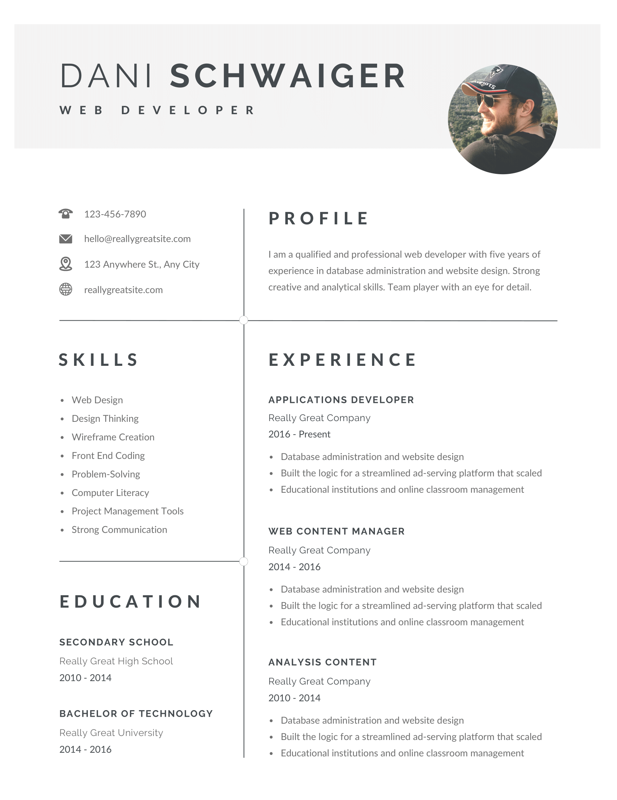
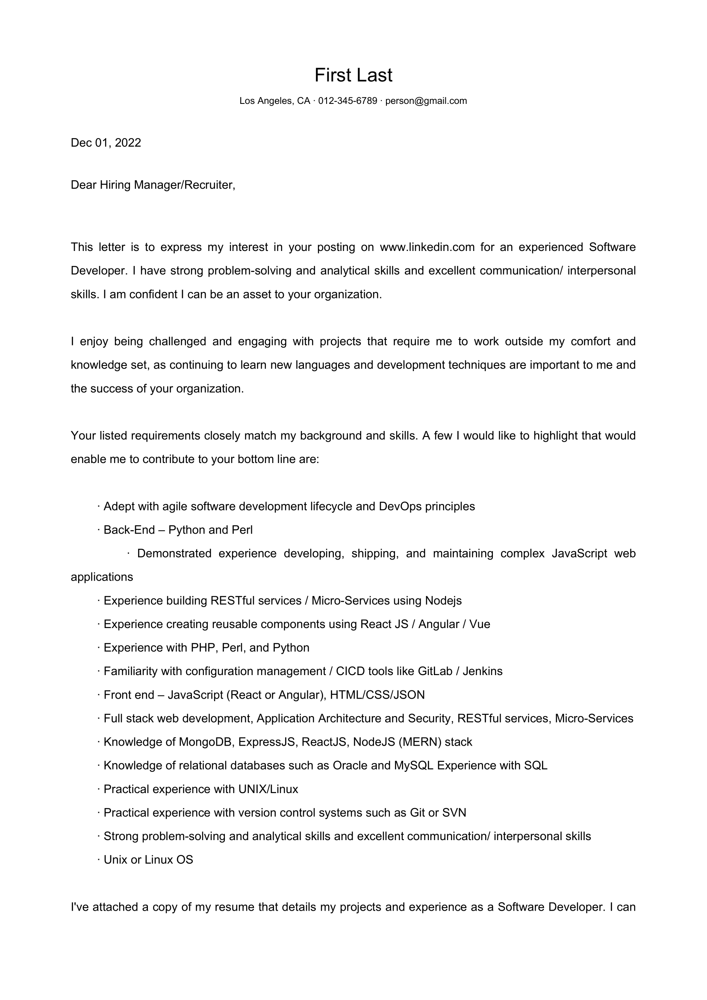

# Cover Letter Writer

## Prerequisites
- Make sure you have Python3 installed on your machine
- Make sure you have FireFox installed on your machine

## Installation
1) `$ git clone <url>` to clone project to local
2) `$ cd cover-letter-writer` to get into root directory of project
3) `$ python3 -m venv venv` to create virtual environment
4) `$ source venv/bin/activate` (mac and linux) `$ venv\Scripts\activate` (windows) to activate environment
5) `$ pip install -r requirements.txt` to install dependencies
6) `$ python3 main.py` to run the program

## Tip
The virtual environment needs to be active when running the python script. 
If you close out the terminal session or deactivate the environment with `source venv/bin/deactivate`, 
you will need to rerun step 4 from "Installation" above to reenter the environment before running `python3 main.py`.

## Getting Started
- Replace "resume.pdf" with a pdf version on your resume with the name "resume.pdf"
- Open up settings.py and configure your custom settings
- Open up urls.txt and paste urls separated by new lines (Can handle as many urls as you want at once)
- After the program runs, your written cover letter will be appended to your resume with the name of the company in the output folder located in the root directory of the project

## Debugging
Sometimes the driver that handles scraping data from urls gets hung up or likes to open a popup and first load. 
If you would like to see what is happening in the driver open `main.py` and set `DEBUG=True`. 
You can close out any popups that may be unhandled or refresh the page as long as the url is not redirected, 
it should proceed as expected.

## Additional
When the cover letter is being written. A copy of it will be saved to the /tmp directory. 
If you need the cover letter detached from your resume, you can get just the cover letter there. 
The cover letter will overwrite for every url so use one url if you want to get it (or make sure it's the last url).

## Support
Here's a list of all the currently supported domains for this program:
- LinkedIn

## Basic Example

### LinkedIn Job Description

```
Top Secret Full Stack Web Developer
Insight Global Fairfax, VA On-site 2 days ago 21 applicants

$115,000/yr - $190,000/yr · Contract · Mid-Senior level
1,001-5,000 employees · Staffing and Recruiting
See how you compare to 21 applicants. Try Premium for free

    You have a preferred skill badge

Top Secret Full Stack Web Developer
Insight Global Fairfax, VA On-site
Meet the hiring team
Bauer
Bauer Cipressi
3rd
Professional Recruiter at Insight Global
Job poster
Message

The ideal candidate must be comfortable going fully onsite to Fairfax, VA five days a week. Also, currently obtains a Top Secret Security Clearance


Purpose:

Helping to build and maintain the web front-end that is connected to a large database for a signal processing application. This is a full-stack development role and will likely start out 75/25 maintenance to new development, and then reverse as time goes on.


Benefits: Up to 8 wks of PTO, employer 401k contribution starts day 1 up to 25%

Positions: Looking for a Senior and a Junior/Mid level Full-Stack Web Developer

What is important:

    Full stack web development, Application Architecture and Security, RESTful services, Micro-Services
    Front end – JavaScript (React or Angular), HTML/CSS/JSON
    Back-End – Python and Perl
    Unix or Linux OS
    Top Secret clearance or higher


Nice to Have:

    Kubernetes or experience building CI/CD pipelines

Key Responsibilities

    Leadership and mentoring of web development team to include Subcontractors (Senior Developer role)
    Develop secure interfaces and web based GUIs to control, status, and monitor signal processing systems
    Implement, test, deploy, and maintain cutting-edge web signal processing systems
    Manage multiple system software configurations and baselines
    Coordinate expert support to Tier 2 Operations and Maintenance support personnel, including oversight of bug tracking and feature requests

Desired Skills and Experience

Strong candidates will have one or more of the following:

    Strong understanding of full-stack, web application architecture, and web security (JSON Web Token)
    Strong proficiency in front end technologies which includes JavaScript, ECMAScript 6, TypeScript, HTML, CSS, JSON
    Knowledge of MongoDB, ExpressJS, ReactJS, NodeJS (MERN) stack
    Knowledge of relational databases such as Oracle and MySQL. Experience with SQL
    Demonstrated experience developing, shipping, and maintaining complex JavaScript web applications
    Deep understanding of modern web application design architecture, API design patterns, performance and scale
    Experience building and supporting responsive web applications using ReactJS or a comparable framework
    Experience creating reusable components using React JS / Angular / Vue
    Familiarity with configuration management / CICD tools like GitLab / Jenkins
    Experience building RESTful services / Micro-Services using Node.js
    Experience with PHP, Perl, and Python
    Ability to understand business requirements and translate them into technical requirements
    Practical experience with version control systems such as Git or SVN
    Looks for opportunities to simplify product & technical design
    Technical designs are clear, well thought out, and considers dependencies, failure states, maintainability, testability and ease of support
    Adept with agile software development lifecycle and DevOps principles
    Experience with geospatial systems and data structures
    Practical experience with UNIX/Linux
    Experience with Integrated Development Environments (IDEs) such as Visual Studio Code
    Strong understanding of professional software engineering best practices for the full SDLC including coding standards, code reviews, source control, build processes, testing, and operations
    Strong problem-solving and analytical skills and excellent communication/ interpersonal skills
    Able to conduct work independently and collaboratively, with minimal supervision
    Experience with Agile development methodologies
    Experience deploying containerized applications to Kubernetes or other orchestration platform 

Education

    BS in Computer Science or equivalent experience

Employer-provided
Pay range in Fairfax, VA

Exact compensation may vary based on skills, experience, and location.
Base salary

$115,000/yr - $190,000/yr
```

### Output

Saved with name and company name: First_Last_Insight_Global_Resume.pdf:




